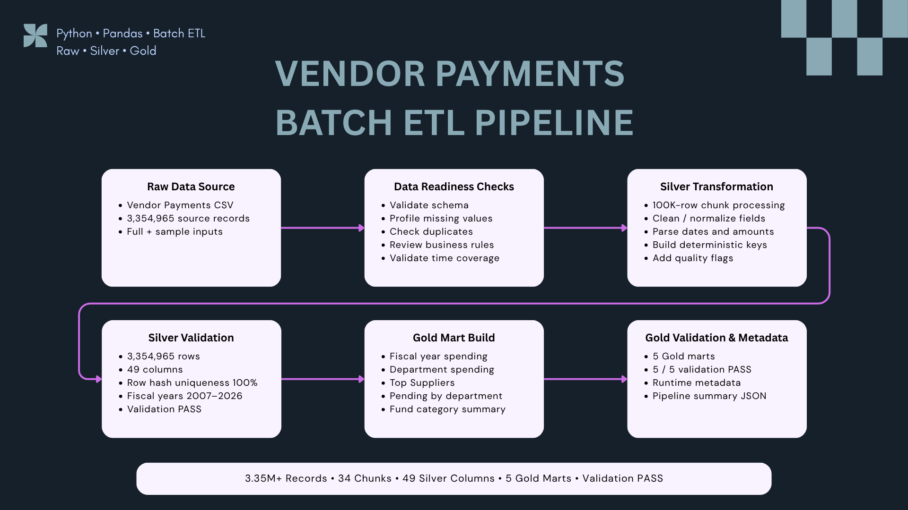
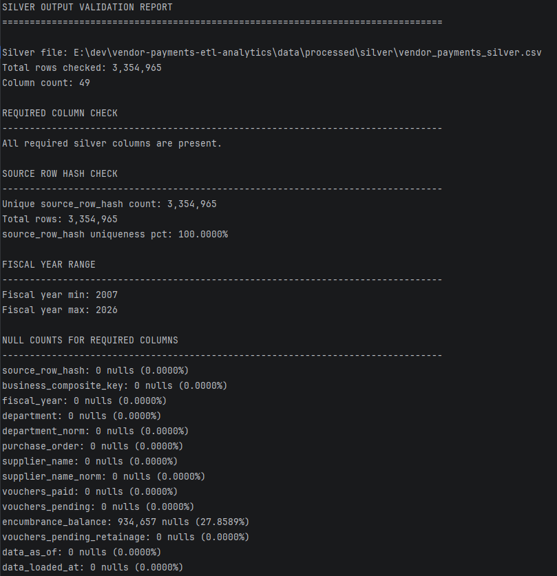
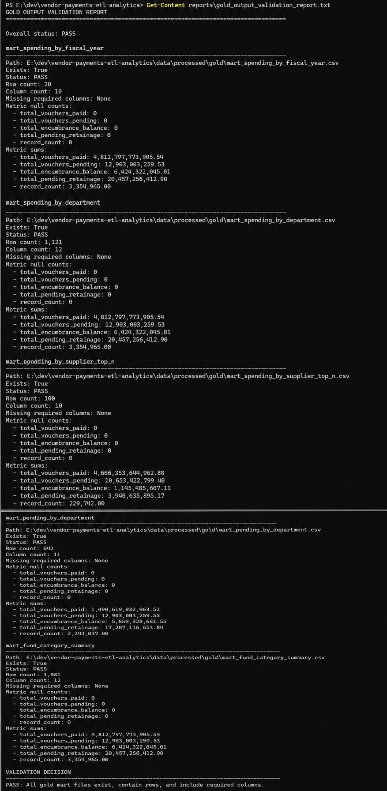
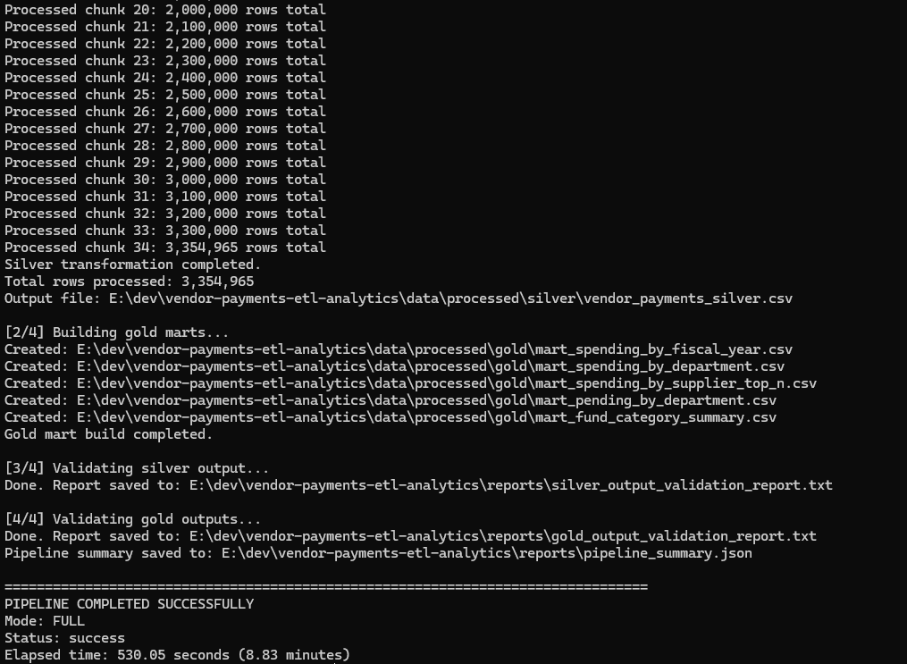
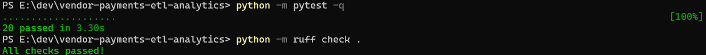
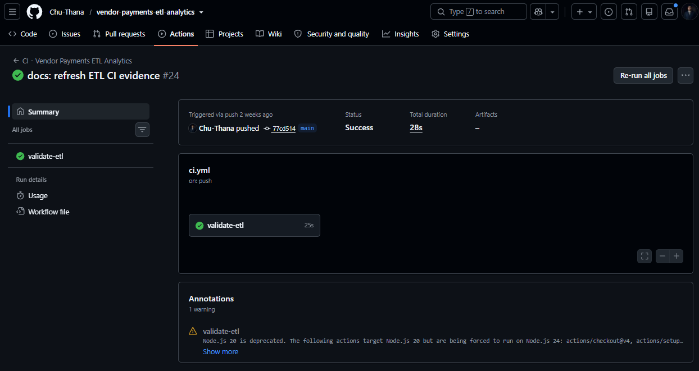

# 📊 Vendor Payments Batch ETL Pipeline


Production-style Batch ETL pipeline for transforming large-scale Vendor Payments data into validated Silver datasets and analytics-ready Gold marts.

This repository is the Batch transformation and data-quality layer of the Vendor Payments Data Engineering Platform. It owns the Raw → Silver → Gold lifecycle and produces trusted outputs for downstream Airflow, AWS, API, and analytics components.

---

## 📌 Project Summary

The pipeline processes more than **3.35 million Vendor Payments records** through a validated Batch ETL workflow.

The current implementation demonstrates:

- Chunk-based processing for large CSV datasets
- Data-readiness checks before transformation
- Raw → Silver → Gold layered processing
- Data cleaning, parsing, and normalization
- Deterministic row identity and business-level keys
- Explicit data-quality flags
- Silver output validation
- Five analytics-ready Gold marts
- Gold output validation
- Machine-readable pipeline metadata
- Sample execution for CI
- Pytest, Ruff, and GitHub Actions validation

The core processing boundary is:

```text
Raw Data
→ Readiness Checks
→ Silver Transformation
→ Silver Validation
→ Gold Mart Build
→ Gold Validation
→ Runtime Metadata
```

---

## 🧭 Architecture



The Batch ETL flow is intentionally independent from the Streaming pipeline.

```text
Raw Data Source
→ Data Readiness Checks
→ Silver Transformation
→ Silver Validation
→ Gold Mart Build
→ Gold Validation & Metadata
```

### Layer Responsibilities

- **Raw Data Source** — Original Vendor Payments CSV plus committed representative sample input.
- **Data Readiness Checks** — Validate schema, missing values, duplicate characteristics, business rules, and time coverage.
- **Silver Transformation** — Process 100K-row chunks, clean and normalize fields, parse dates and amounts, build deterministic keys, and add quality flags.
- **Silver Validation** — Verify output row count, required columns, row-hash uniqueness, fiscal-year coverage, and required-field null behavior.
- **Gold Mart Build** — Build fiscal-year, department, supplier, pending-payment, and fund-category analytics marts.
- **Gold Validation & Metadata** — Validate all five marts and generate structured execution metadata.

---

## 📊 Validated Results

| Metric | Result |
| --- | ---: |
| Source records processed | 3,354,965 |
| Silver records produced | 3,354,965 |
| Processing chunks | 34 |
| Chunk size | 100,000 rows |
| Silver columns validated | 49 |
| Source row hash uniqueness | 100% |
| Gold marts produced | 5 |
| Gold marts passed validation | 5 / 5 |
| Latest full execution runtime | 530.05 seconds |
| Latest full execution duration | 8.83 minutes |
| Automated tests | 20 passed |
| Ruff linting | PASS |
| Pipeline status | Success |
| GitHub Actions CI | PASS |

---

## 📂 Dataset

The source dataset contains government Vendor Payments and purchase-order records.

Fields include:

- Fiscal year
- Organization group and department
- Program and fund information
- Supplier / payee name
- Purchase-order reference
- Voucher paid and pending amounts
- Encumbrance balance
- Contract information
- Source freshness timestamps

The full source file remains local because of its size:

```text
data/raw/Vendor_Payments.csv
```

A representative sample is committed for local validation and CI:

```text
data/sample/vendor_payments_sample.csv
```

---

## 🧪 Data Readiness Checks

The source is profiled before transformation.

| Check | Purpose |
| --- | --- |
| File Structure | Validate file shape, delimiter, header, and malformed rows |
| Schema | Confirm expected source columns |
| Data Types | Validate numeric, date, timestamp, and identifier parsing |
| Missing Values | Separate critical, warning-level, and optional fields |
| Duplicate Strategy | Evaluate row identity and business-level keys |
| Business Rules | Detect negative payments, large values, and date inconsistencies |
| Dimension Profiling | Review departments, suppliers, programs, and funds |
| Time Coverage | Validate fiscal-year range and source freshness |

The readiness process informs transformation rules rather than silently dropping suspicious records.

---

## 🥈 Silver Transformation

The Silver layer standardizes Raw data while preserving row-level traceability.

Processing includes:

- Expected schema validation
- 100,000-row chunk processing
- Snake-case column renaming
- Numeric cleaning
- Date and timestamp parsing
- Contract-number normalization
- Text trimming and normalization
- Deterministic `source_row_hash`
- Business-level `business_composite_key`
- Fiscal-year and purchase-order date comparison
- Explicit data-quality flags

Silver output:

```text
data/processed/silver/vendor_payments_silver.csv
```

Representative quality flags include:

```text
is_missing_department
is_missing_purchase_order_date
is_negative_paid
is_large_paid_1m
is_large_paid_10m
is_large_paid_100m
is_large_paid_1b
is_fiscal_year_mismatch
is_non_profit
```

---

## ✅ Silver Output Validation

The latest full Silver validation confirms:

```text
Total rows checked: 3,354,965
Column count: 49
All required Silver columns are present
Unique source_row_hash count: 3,354,965
source_row_hash uniqueness: 100.0000%
Fiscal year range: 2007–2026
```



Required business and identifier fields are checked explicitly. Nullable fields are reported rather than silently ignored.

---

## 🥇 Gold Analytics Marts

The Gold layer builds five analytics-ready datasets.

| Mart | Purpose | Rows |
| --- | --- | ---: |
| `mart_spending_by_fiscal_year` | Fiscal-year spending trends | 20 |
| `mart_spending_by_department` | Department-level spending analytics | 1,121 |
| `mart_spending_by_supplier_top_n` | Top supplier analysis | 100 |
| `mart_pending_by_department` | Pending voucher monitoring | 642 |
| `mart_fund_category_summary` | Fund type and category analytics | 1,061 |

Gold output directory:

```text
data/processed/gold/
```

Each mart contains aggregated payment metrics, record counts, and selected data-quality indicators.

---

## ✅ Gold Output Validation

The latest Gold validation confirms:

```text
Overall status: PASS

mart_spending_by_fiscal_year      PASS
mart_spending_by_department       PASS
mart_spending_by_supplier_top_n   PASS
mart_pending_by_department        PASS
mart_fund_category_summary        PASS
```

Final validation decision:

```text
PASS: All gold mart files exist, contain rows, and include required columns.
```



---

## 🖥️ Full Batch Execution

The latest full run processed all **3,354,965 records** in **34 chunks** and produced all five Gold marts.

```text
Mode: FULL
Status: success
Total rows processed: 3,354,965
Chunks processed: 34
Gold marts created: 5
Elapsed time: 530.05 seconds
Duration: 8.83 minutes
```



The pipeline also generates:

```text
reports/pipeline_summary.json
reports/silver_output_validation_report.txt
reports/gold_output_validation_report.txt
```

---

## 🧾 Runtime Metadata

Each execution generates a machine-readable summary.

Full mode:

```text
reports/pipeline_summary.json
```

Sample mode:

```text
reports/pipeline_summary_sample.json
```

The summary records:

```text
Project identity
Pipeline version
Execution mode
Execution status
Runtime
Chunk size
Source row count
Silver row count
Chunk count
Gold mart count
Validation outputs
```

This provides structured execution evidence instead of relying only on console logs.

---

## 🧪 Automated Testing and Code Quality

Run:

```powershell
python -m pytest -q
python -m ruff check .
```

Current result:

```text
20 passed
All checks passed!
```



Automated tests cover schema definitions, cleaning, deterministic keys, sample execution, Gold mart generation, and pipeline metadata.

---

## ⚙️ Continuous Integration

GitHub Actions validates the repository on configured pushes and pull requests.

The CI flow uses the committed representative sample rather than requiring the full local source dataset.

```text
Repository checkout
→ Python setup
→ Dependency installation
→ Ruff validation
→ Sample ETL execution
→ Pytest validation
```



The latest CI workflow completes successfully on `main`.

---

## 📸 Final Execution Evidence

```text
00_batch_etl_architecture.png
01_full_batch_execution.png
02_silver_output_validation.png
03_gold_output_validation.png
04_batch_tests_and_lint.png
05_batch_ci_success.png
```

The evidence set covers architecture, full-scale execution, Silver validation, Gold validation, local automated testing, linting, and CI.

---

## 🗂️ Project Structure

```text
vendor-payments-etl-analytics/
│
├── assets/
│   ├── 00_batch_etl_architecture.png
│   ├── 01_full_batch_execution.png
│   ├── 02_silver_output_validation.png
│   ├── 03_gold_output_validation.png
│   ├── 04_batch_tests_and_lint.png
│   └── 05_batch_ci_success.png
│
├── data/
│   ├── raw/
│   ├── sample/
│   └── processed/
│       ├── silver/
│       ├── gold/
│       └── gold_sample/
│
├── reports/
│   ├── data_readiness_summary.md
│   ├── pipeline_summary.json
│   ├── pipeline_summary_sample.json
│   ├── silver_output_validation_report.txt
│   └── gold_output_validation_report.txt
│
├── scripts/
│   ├── checks/
│   └── pipeline/
│
├── src/
│   ├── cleaning.py
│   ├── config.py
│   ├── keys.py
│   └── schema.py
│
├── tests/
├── .github/
│   └── workflows/
│       └── ci.yml
├── pyproject.toml
├── pytest.ini
├── requirements.txt
└── README.md
```

---

## ▶️ Run Locally

Create and activate a virtual environment:

```powershell
python -m venv .venv
.\.venv\Scripts\Activate.ps1
```

Install dependencies:

```powershell
python -m pip install --upgrade pip
python -m pip install -r requirements.txt
```

### Full Pipeline

```powershell
python scripts/pipeline/run_pipeline.py
```

### Sample Pipeline

```powershell
python scripts/pipeline/run_pipeline.py --sample
```

Sample mode supports reproducible local validation and GitHub Actions without requiring the full source dataset.

---

## ☁️ Airflow Integration

The Batch ETL repository remains independently runnable.

In the integrated platform, the dedicated **Batch Pipeline DAG** owns the Batch execution lifecycle:

```text
Check Batch ETL source
→ Run full Batch ETL
→ Check Silver output
→ Check Gold outputs
→ Upload trusted Gold marts to S3
→ Load Batch data to Redshift
→ Validate analytics
→ Athena ↔ Redshift cross-layer validation
```

Responsibility remains separated:

```text
vendor-payments-etl-analytics
→ Raw → Silver → Gold transformation
→ Silver / Gold validation

vendor-payments-airflow-orchestration
→ execution order
→ Cloud publishing
→ warehouse loading
→ downstream validation
```

---

## 🔗 Role in the Vendor Payments Data Platform

```text
Vendor Payments Raw Data
→ Batch ETL
→ Validated Silver
→ Validated Gold marts
→ Airflow Batch Pipeline DAG
→ Amazon S3
→ Athena / Redshift
→ FastAPI
→ React / Analytics
```

The same validated Silver dataset is also used as the source for deterministic bounded Streaming-window preparation, while the Batch and Streaming processing lifecycles remain independent.

---

## 🧠 Key Engineering Decisions

### Why use chunk-based processing?

The full source contains more than 3.35 million records. Processing in 100,000-row chunks reduces peak memory usage and avoids loading the entire dataset at once.

### Why keep Raw, Silver, and Gold separate?

```text
Raw
→ preserve source data

Silver
→ clean, normalize, and validate row-level data

Gold
→ produce analytics-ready aggregates
```

### Why use `source_row_hash`?

The source does not provide a reliable single-column primary key. `source_row_hash` provides deterministic row-level identity and supports row-preservation validation.

### Why use a business composite key?

Purchase-order values are not globally unique and many records represent direct payments. The business composite key supports business-level duplicate analysis without incorrectly treating purchase order as a primary key.

### Why preserve negative and large payments?

These values may represent adjustments, reversals, corrections, or legitimate high-value transactions. The pipeline flags them rather than deleting them automatically.

### Why use sample mode?

The full dataset is too large to commit and should not be required by CI. Sample mode provides a reproducible execution path for testing and GitHub Actions.

### Why generate runtime metadata?

Machine-readable metadata makes row counts, runtime, output availability, and validation state reusable by downstream orchestration and portfolio evidence.

---

## 🛣️ Planned Improvements

Possible production-oriented extensions include:

- Incremental or partition-aware Batch processing
- Persistent execution-history storage
- Configurable data-quality thresholds
- Centralized observability and alerting
- Cloud-backed source ingestion
- Additional performance and memory profiling

---

## 🎯 Key Takeaway

The Batch ETL Pipeline converts a large Raw Vendor Payments source into trusted Silver and Gold datasets through explicit transformation and validation stages.

```text
3.35M+ Raw Records
→ 34 Processing Chunks
→ 3,354,965 Validated Silver Rows
→ 5 Validated Gold Marts
→ Runtime Metadata
→ Airflow / AWS / API / Analytics
```

The result is a reproducible Batch foundation with clear data-layer responsibilities, row-level traceability, analytics-ready outputs, automated validation, and downstream integration.
